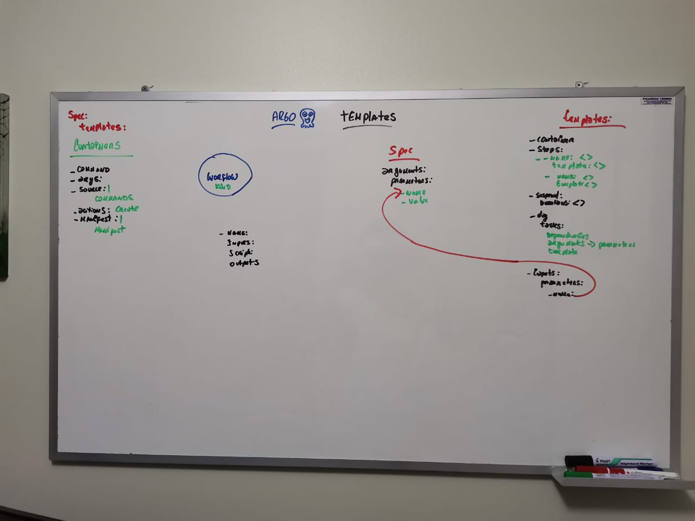

# Argo workflows on Kubernetes

## Install Argo

```bash
#https://argoproj.github.io/argo-workflows/quick-start/
kubectl create ns argo
kubectl apply -n argo -f https://raw.githubusercontent.com/argoproj/argo-workflows/master/manifests/quick-start-postgres.yaml
kubectl -n argo port-forward deployment/argo-server 2746:2746
https://localhost:2746/
```

## Commands Workflow

```bash
kubectl create -f wf-hello-world.yaml -n argo
kubectl get workflow -n argo
```

## Artifacts Logs Workflow

```bash
kubectl -n argo port-forward pod/minio-77d6796f8d-lrcnf 9000:9000
http://localhost:9000/ #admin, password
kubectl get cm -n argo
kubectl describe cm workflow-controller-configmap -n argo
kubectl -n argo edit cm workflow-controller-configmap #change options
```

## Argo CLI

```bash
#https://github.com/argoproj/argo-workflows/releases
wget https://github.com/argoproj/argo-workflows/releases/download/v3.1.9/argo-linux-amd64.gz
gunzip argo-linux-amd64.gz
chmod +x argo-linux-amd64
sudo mv ./argo-linux-amd64 /usr/local/bin/argo
argo version

#Commands
argo -n argo submit wf-input-parameter-dag.yaml
argo -n argo delete wf-input-parameter-dag
argo -n argo list
argo -n argo submit wf-input-parameter-dag.yaml -p message1="Parameter used from terminal"
argo -n argo submit wf-input-parameter-dag.yaml --parameter-file parameters.yaml
```

## Secrets

```bash
kubectl -n argo create secret generic test-secret --from-file=test-password=test_password_file.txt
kubectl -n argo get secret test-secret
kubectl -n argo describe secret test-secret
```

## Templates

```bash
argo -n argo template create wftmpl-dag.yaml
argo -n argo template list
argo -n argo submit --from workflowtemplate/wftmpl-dag
argo -n argo list
argo -n argo template delete wftmpl-dag
argo -n argo template get wftmpl-dag -o yaml
```

## Exorcises

### Exorcise, 2 comamnds

```bash
echo https://udemy-sources-bucket-mt2h.s3.us-east-2.amazonaws.com/emails.csv > source_url.txt
echo email@gmail.com > notitication_email.txt
kubectl -n argo create secret generic exorcise-2-secret --from-file=source_url=source_url.txt --from-file=notitication_email=notitication_email.txt
kubectl get secret -n argo
kubectl describe secret exorcise-2-secret -n argo
argo -n argo submit wf-exorcise-2.yaml --dry-run -o yaml
argo -n argo submit wf-exorcise-2.yaml
kubectl describe wf wf-exorcise2 -n argo
```

## Board


